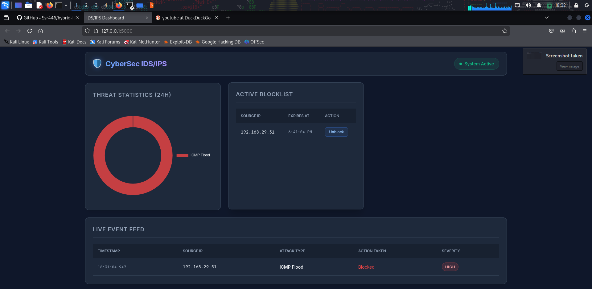
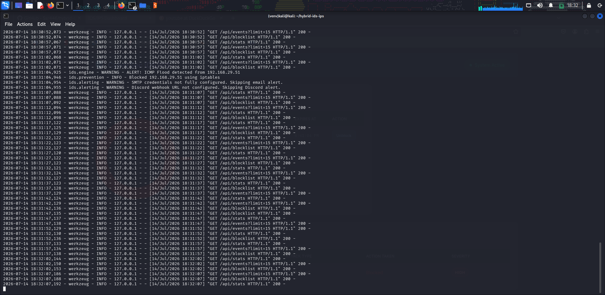
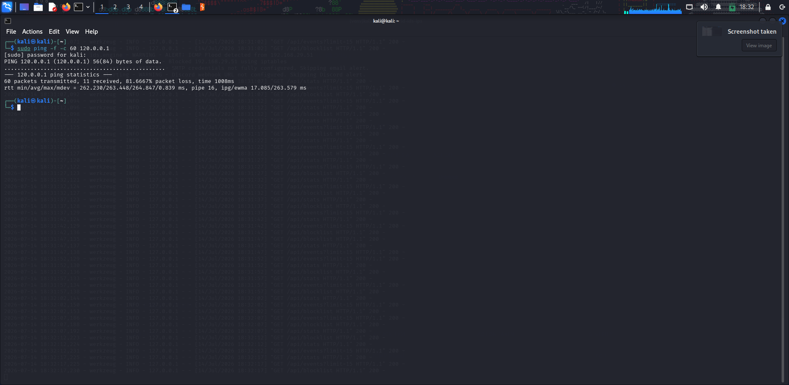

# Hybrid Network Intrusion Detection & Prevention System

## About the Project
This project is a hybrid Network Intrusion Detection and Prevention System (IDS/IPS) engineered in Python. It provides real-time network traffic analysis, threat detection, and automated mitigation capabilities. 

Designed for both educational demonstration and live deployment, the system leverages deep packet inspection to identify malicious network behavior and interacts directly with Linux kernel firewalls to neutralize threats dynamically. A built-in simulation mode allows developers to test the detection engine safely without requiring elevated system privileges or exposing host networks.

## Core Capabilities
- **Packet Sniffing**: Utilizes Scapy for low-level packet capture, supporting both live interface monitoring and offline PCAP file analysis.
- **Threat Detection**: A modular, rule-based detection engine capable of identifying SYN Scans, ICMP Floods, and ARP Spoofing anomalies.
- **Active Prevention**: Integrates with `iptables` to automatically drop traffic from offending source IP addresses, managing an auto-expiring blocklist.
- **Alerting Mechanisms**: Features SMTP email and Discord Webhook integration for real-time administrator notifications.
- **Analytics Dashboard**: A robust, responsive web interface built with Flask and Chart.js, providing live event feeds, threat statistics, and active blocklist management.

## Screenshots





## System Architecture

The architecture is highly modular, designed around a core `DetectionEngine` that passes captured packets to a suite of registered `BaseDetector` subclasses. 
Configuration thresholds (e.g., packet-per-second limits, block durations) are externalized in `config.yaml` to allow fine-tuning without code modifications. Event state and statistics are persisted using SQLite.

## Setup Instructions

### 1. Local Development (Simulation Mode)
Simulation mode replays a synthetic PCAP file and bypasses live firewall modifications. This allows the system to run safely on any operating system without root privileges.

```bash
# Clone the repository
git clone https://github.com/Ssr446/hybrid-ids-ips.git
cd hybrid-ids-ips

# Create a virtual environment and install dependencies
python -m venv venv
source venv/bin/activate  # On Windows: venv\Scripts\activate
pip install -r requirements.txt

# Generate the synthetic simulation PCAP data
python generate_pcap.py

# Execute the application in simulation mode
SIMULATION_MODE=true python app.py
```
Access the web dashboard at `http://localhost:5000`.

### 2. Live Deployment (Real-Time Sniffing and Prevention)
To utilize live packet sniffing and dynamic `iptables` blocking, the application must be deployed on a Linux host with root privileges. We recommend provisioning a free Linux instance via cloud providers such as Oracle Cloud (Always Free tier) or AWS.

1. Provision a Linux Virtual Machine (e.g., Ubuntu).
2. Configure your cloud provider's network security group to allow inbound traffic on TCP port `5000`.
3. Connect to the instance via SSH:
   ```bash
   ssh user@<your-vm-ip>
   ```
4. Install system dependencies:
   ```bash
   sudo apt update
   sudo apt install -y python3-pip python3-venv iptables
   ```
5. Clone and configure the application:
   ```bash
   git clone https://github.com/Ssr446/hybrid-ids-ips.git
   cd hybrid-ids-ips
   python3 -m venv venv
   source venv/bin/activate
   pip install -r requirements.txt
   ```
6. Execute the application with elevated privileges:
   ```bash
   # SIMULATION_MODE must be false or unset for live operation
   sudo ./venv/bin/python app.py
   ```
7. Access your live dashboard at `http://<your-vm-ip>:5000`.
